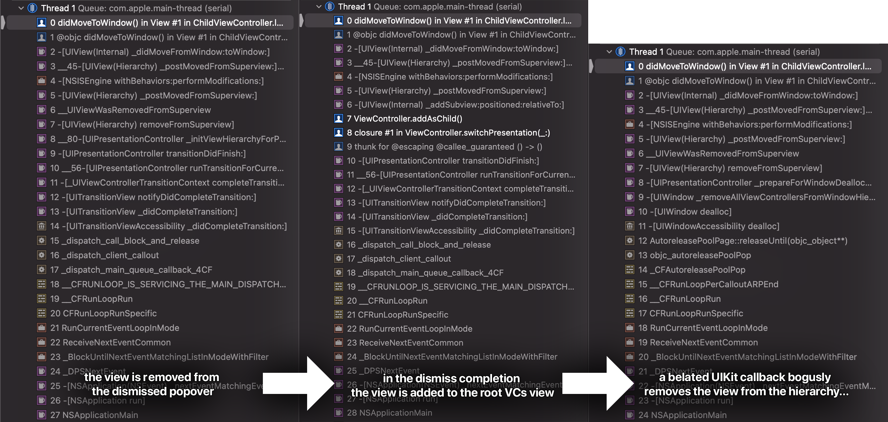

# CatalystPopoverBug
Demonstration project for a bug in macOS 11.0.1 when using UIKit popovers via Catalyst

# Usage

1. Clone this repository
1. Open `CatalystPopoverBug.xcodeproj` in Xcode
1. Run the `CatalystPopoverBug` target on Mac

# Description

The app consists of a root VC which fills the window, and a child VC with yellow background. The button in the child VC alternately changes between presenting the child in a popover, or embedding it inside the root VC. 

This is how the **expected** behaviour looks like:


#### Bug #1 (macOS): UIKit is messing with the child VCs view even after UIViewController.dismiss(animated:completion:) had finished

Let's remove the [async dispatch from here](CatalystPopoverBug/ViewController.swift#L73):
```
            viewController.dismiss(animated: true) {
                // Calling addAsChild() directly won't work on macOS 11.0.1
                DispatchQueue.main.async {
                    self.addAsChild()
                }
            }
```
like this:
```
            viewController.dismiss(animated: true) {
                self.addAsChild()
            }
```
Now if we launch the app, and try to move the child VC from the popover to the root VC, it simply disappears:


We can observe what's happening by overriding `didMoveToWindow()` in the child VCs root view, [and placing a breakpoint there](CatalystPopoverBug/ViewController.swift#L33):



1. When the popover is dismissed, the view is removed from the popover's window
1. Then from `UIViewController.dismiss(animated:completion:)`'s completion callback, we add the view to the root VCs view. **At this point, UIKit should have finished the dismiss transition, and the view controller should be ours to mess with.**
1. But then some async UIKit mechanism removes the view **again**. Based on the stack trace, this is coming from the popover window's belated `dealloc`.

The same code (i.e. without the async dispatch) works fine on iOS, so the bug is specific macOS Catalyst.

#### Bug #2 (iOS): warning about "unbalanced begin/end appearance transitions" when presenting the popover

Let's run the app on iOS, but first [remove the timer from here](CatalystPopoverBug/ViewController.swift#L83):
```
Timer.scheduledTimer(withTimeInterval: 0.01, repeats: false) { _ in
                self.presentAsPopover()
            }
```
Like this:
```
                self.presentAsPopover()
```
We find that whenever the popover is presented, the following warning is printed to the console:

>Unbalanced calls to begin/end appearance transitions for <CatalystPopoverBug.ChildViewController: 0x7fd50b205550>.


Putting back the timer resolves the issue, **but it's time interval must be greater than zero - a 0 sec timer or a simple async dispatch will still reproduce the issue!**
